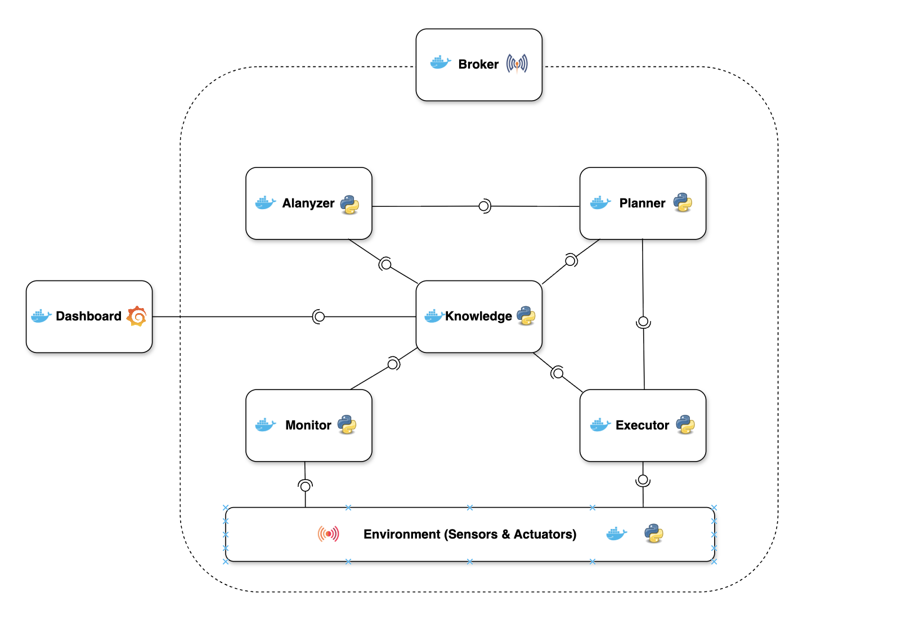

# Autonomous Poultry Farm Manager 🐔

An autonomous, self-adaptive system (SAS) designed to manage environmental conditions in poultry farms using the **MAPE-K** feedback loop architecture.

## 1. Introduction
This project is an **Autonomous Self-Adaptive System (SAS)** designed to manage the delicate environment of modern poultry farms. It acts as an "Autopilot", creating a closed feedback loop: it watches sensors, analyzes conditions, plans actions, and controls fans/heaters continuously.

### The Problem ⚠️
Poultry birds are extremely sensitive to environmental changes.
*   **Temperature**: Too hot (>28°C) = Heat stress/death. Too cold (<20°C) = Sickness.
*   **Air Quality**: CO2 and Ammonia (from waste) can damage respiratory systems.
*   **Complexity**: Temperature, humidity, and air quality interact (e.g., turning on fans cools the barn but also removes humidity).
*   **Scale**: Managing dozens of barns manually 24/7 is labor-intensive and error-prone.

### The Solution 💡
A distributed system that continuously monitors the farm and adjusts actuators (fans, heaters, windows) to maintain optimal conditions.

Key features:
*   **Autonomous Regulation**: Automatically controls Temperature, Air Quality (CO2, NH3), and Light cycles.
*   **Physics-Based Simulation**: Includes a robust environment simulator for testing and validation without risking real animals.
*   **Distributed Architecture**: Uses **MAPE-K** to separate concerns and allow for independent scaling.
*   **Configurable**: Manages multiple farms/zones with different physics and requirements via a central `system_config.json`.

---

## 2. Architecture (MAPE-K) 🏛️

The system follows the **MAPE-K** architectural pattern (Monitor, Analyze, Plan, Execute, Knowledge) widely used in autonomous computing. It is built as a set of Docker microservices communicating via an **MQTT Bus**.

<p align="center">
  
</p>

### MAPE-K Matrix: System vs Human Analogy

| Component | Role | Analogous Human Action |
| :--- | :--- | :--- |
| **Managed System** | The physical farm (simulated here). | The Barn itself. |
| **Monitor (M)** | Data Collection. | Checking the thermometer. |
| **Analyzer (A)** | Diagnosis. | Thinking "It's too hot in here." |
| **Planner (P)** | Decision Making. | Deciding "I should turn on the fan." |
| **Executor (E)** | Action. | Walking to the switch and hitting it. |
| **Knowledge (K)** | Memory & Rules. | Knowing that 28°C is the danger limit. |

---

## 3. How It Works (End-to-End Flow)

Let's trace a single "Heartbeat" of the system:

1.  **Simulation Tick**: The `Environment` service simulates 5 seconds of physics. The temperature rises because of the birds' body heat.
2.  **Sensing**: The environment publishes a message to MQTT:
    *   `Topic`: `farm1/zone1/sensors/air`
    *   `Payload`: `{"temperature_c": 28.5, "co2_ppm": 1200}`
3.  **Monitoring**: The `Monitor` service sees this message and saves it to **InfluxDB** (Knowledge).
4.  **Analysis**: The `Analyzer` service wakes up, reads the latest data from InfluxDB, and compares it to `system_config.json`.
    *   *Rule*: Temp limit is 28.0.
    *   *Reality*: Temp is 28.5.
    *   *Result*: Uses MQTT to broadcast: `STATUS = CRITICAL (High Temp)`.
5.  **Planning**: The `Planner` service receives the Status.
    *   It calculates the error (0.5°C over limit).
    *   It uses a **P-Controller** to calculate required cooling: `Fan_Speed = Error * Kp = 0.5 * 10 = 5% increase`.
    *   It publishes a **Plan** to MQTT.
6.  **Execution**: The `Executor` service translates the Plan into a specific hardware command.
    *   `Topic`: `farm1/zone1/cmd/fan`
    *   `Payload`: `{"action": "SET", "level": 60}`
7.  **Actuation**: The `Environment` receives the command, spins up the simulated fan, and the temperature starts dropping.

---

## 4. Components in Detail

*   **Managed System (Environment)** 🏠
    *   `environment/model.py`: Physics (thermodynamics, gas laws) and biology (bird metabolism) simulation.
*   **Monitor (M)** 👁️
    *   `monitor/monitor_service.py`: Pure data ingestion. Standardizes and logs raw MQTT sensor data into **InfluxDB**.
*   **Analyzer (A)** 🧠
    *   `analyzer/analyzer_service.py`: Symptom Detection. Checks knowledge against goals (from `system_config.json`) and publishes Status events.
*   **Planner (P)** 📋
    *   `planner/planner_service.py`: **The Brain**. Decides on actions using P-Controllers and Hysteresis logic to smooth out fluctuations and prevent rapid toggling.
*   **Executor (E)** ⚙️
    *   `executor/executor_service.py`: **The Hands**. Translates high-level Plans into specific actuator hardware commands.
*   **Knowledge (K)** 📚
    *   **InfluxDB**: Time-series history (Simulated "Experience").
    *   **system_config.json**: Policies, Thresholds, and Physics parameters.

---

## 5. Getting Started 🚀

### Prerequisites
*   [Docker Desktop](https://www.docker.com/products/docker-desktop)
*   Git

### Installation
1.  **Clone the repository**:
    ```bash
    git clone https://github.com/Saleh7127/SE4AS_PoultryFarmManager.git
    cd SE4AS_PoultryFarmManager
    ```

2.  **Configure Environment**:
    *   **Infrastructure**: Check `.env` for infrastructure settings (MQTT ports, InfluxDB credentials).
    *   **Domain Logic**: Check `system_config.json` for farm rules (Thresholds, Physics).

3.  **Start the System**:
    ```bash
    docker compose up -d --build
    ```

4.  **Access Dashboards**:
    *   **Grafana**: `http://localhost:3000` (User: `admin`, Pass: `admin`)
    *   **InfluxDB**: `http://localhost:8086` (User: `admin`, Pass: `adminadmin`)

---

## 6. Manual Control (MQTT Guide)

You can interact with the system manually by sending MQTT messages. This mimics what the Executor does.

### Tools
Use `mosquitto_pub` inside the docker container or any desktop MQTT client (like MQTT Explorer).

### Command Structure
*   **Topic**: `{farm_id}/{zone_id}/cmd/{actuator}`
*   **Actuators**: `fan`, `heater`, `inlet`, `light`, `feed_dispenser`, `water_valve`.

### Examples

**1. Turn on the Fan to 100%**
```bash
docker compose exec mqtt mosquitto_pub -u admin -P admin -t "farm1/zone1/cmd/fan" -m '{"action": "SET", "level": 100}'
```

**2. Turn on the Heater**
```bash
docker compose exec mqtt mosquitto_pub -u admin -P admin -t "farm1/zone1/cmd/heater" -m '{"action": "SET", "level_pct": 50}'
```

**3. Refill the Feed Hopper**
```bash
docker compose exec mqtt mosquitto_pub -u admin -P admin -t "farm1/zone1/cmd/feed_dispenser" -m '{"action": "ON"}'
```
*Note: The simulation will react to these commands immediately, but the Planner might overwrite your manual commands if the auto-control logic disagrees!*

---

## 7. Project Structure 📂

*   **`analyzer/`**: (A) Service that checks sensor data against thresholds.
*   **`planner/`**: (P) Service that decides actions.
*   **`executor/`**: (E) Service that sends commands.
*   **`monitor/`**: (M) Service that logs data.
*   **`environment/`**: Managed System Simulation.
*   **`common/`**: Shared code (config loader, InfluxDB wrapper).
*   **`mosquitto/`**: MQTT broker configuration.
*   **`grafana/`**: Grafana provisioning.
*   **`system_config.json`**: Central configuration for thresholds, physics, and zones.
*   **`docker-compose.yml`**: Orchestration for all services.

## 8. Technologies Used 🛠️
*   **Docker**: Microservice containerization.
*   **Eclipse Mosquitto**: Real-time MQTT messaging bus.
*   **InfluxDB**: Time-series Knowledge Base.
*   **Grafana**: Visualization.
*   **Python**: Core logic.

